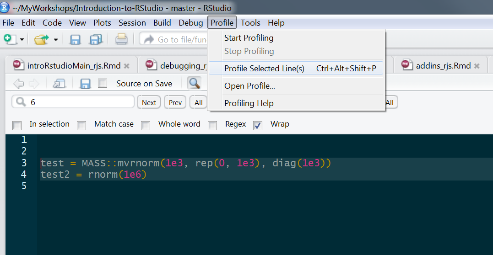
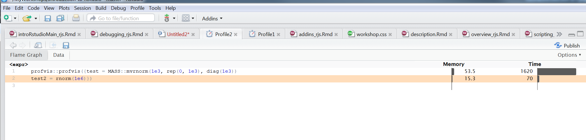

## 

<h1>Debugging   Profiling<h1>

## What is Debugging?

Debugging is merely finding and fixing problematic code

  - Code will ***always*** have bugs

Debugging is an essential part of creating good functions 

 

## A note about functions

If you are doing anything more than twice, write a function!

- It's more generalizable
- It's more reproducible
- It's more efficient

Debugging can allow one to spot issues

RStudio can even help you get started transforming existing code to a function

- Ctrl+Alt+X/Cmd+Opt+X on highlighted code

## Debugging in RStudio

There are basic facilities within R to help you debug your code

- debug

- debugonce

- Break Points

- traceback

- browser

RStudio makes the process pretty easy

## Debug Mode Commands

There are commands that allow you to work through debugging:

- Next: runs the next line

- Step into: enters into a new function

  - debug functions within debugged functions `r emo::ji('smile')`

- Finish: finishes the function

- Continue: stops debugging and runs the function

- Stop: stops debugging and does not run the function

## Debug Mode Commands

Both command line and keyboard shortcuts for these

And they also have a button in the debugging menu

## Debugging

You don't have to be a package developer to use

Debugging is a great way to find out *why* you have an error

## Profiling

Code profiling allows one to see what parts of the code take most of the processing time and resources (memory)

Like debugging, there have always been tools in base R for this, but RStudio makes it easy to profile any code

Furthermore, it doesn't have to be an explicit function

## Profiling

## Debugging and profiling

Debugging and profiling are important parts of advanced programming

One should desire to make code as general and reproducible as possible

- Regardless of expertise!

RStudio makes the process more interactive and flexible!
