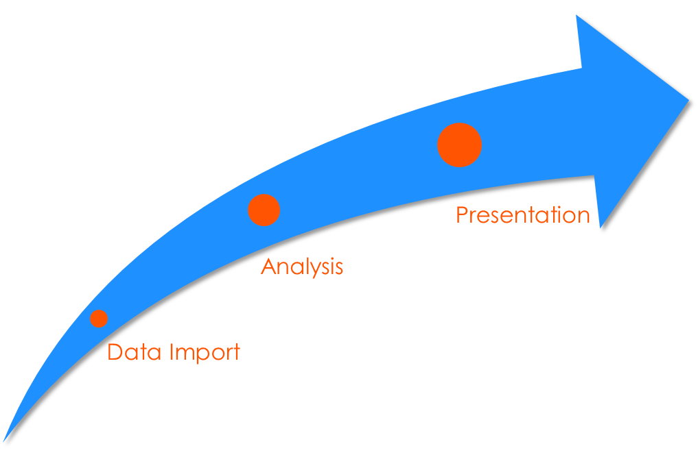

##

<h1>Overview<h1>

## Overview 

Base R is an extremely powerful tool. However...

The console is not conducive to efficiency

The syntax editor in Base R is just a simple text editor

There are actually many options for R:

- RStudio
- General text editors like Notepad++, Atom, Sublime, Vim
- Other R-based text editors e.g. Emacs Speaks Statistics
- Other R-based IDE options e.g. Architect
- Other IDEs with R functionality, e.g. Eclipse, Visual Studio

## Overview

RStudio (the IDE) offers:

- Code completion and snippets
- Code diagnostics
- Customizable shortcuts
- Document generation (web, pdf, presentation, .doc)
- Web publishing
- Other services: RStudio Server, RSConnect, Shiny Server etc.

## Overview

RStudio offers:

- Enhanced debugging, profiling
- Navigable data frames
- Version control
- Interactive visualization
- Addins

## Overview 

RStudio is also an excellent tool for reproducible research.

- Project management
- Package building and freezing
- Document generation

