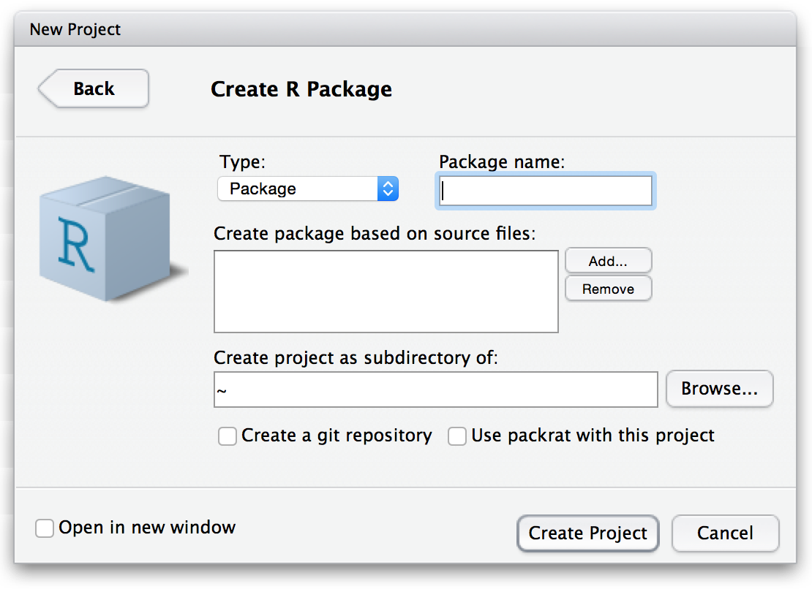

## 

<h1>Package Development<h1>

## Package Development

RStudio makes package development easier too

- New Project/New Directory/R Package

## R Package Dialog Box

"Create package based on source files" 

- allows you to include previously written functions in your new package
- functions you added at this step will have their own help files created
- You will still need to complete the help files

## What You Get

RStudio will automatically start you out with the following:

  - DESCRIPTION: Just like every R package

  - A 'man' folder: Contains .Rd files for each function

  - An 'R' folder: Contains your functions

The roxygen2 package helps to properly format your documentation files

## Build, Reload, Check

After you have all of your files ready, build the package

Packages tend to have a lot happening in them

Run the check function from devtools on it

It will check package quality across many dimensions:

- Ability to install package and its dependencies
- Checking help file quality
- Find errors in examples

## Packages

RStudio makes package creation a straight-forward process

Then there are packages that help you do the most common things automatically, like...

- devtools: build, check, clean, etc. 
- usethis: create commonly used files and more
- testthat: test your functions
- pkgdown: create a website for your package  

You should not be afraid to create your own packages

- Even for just personal use!
- Within a project → greater reproducibility 